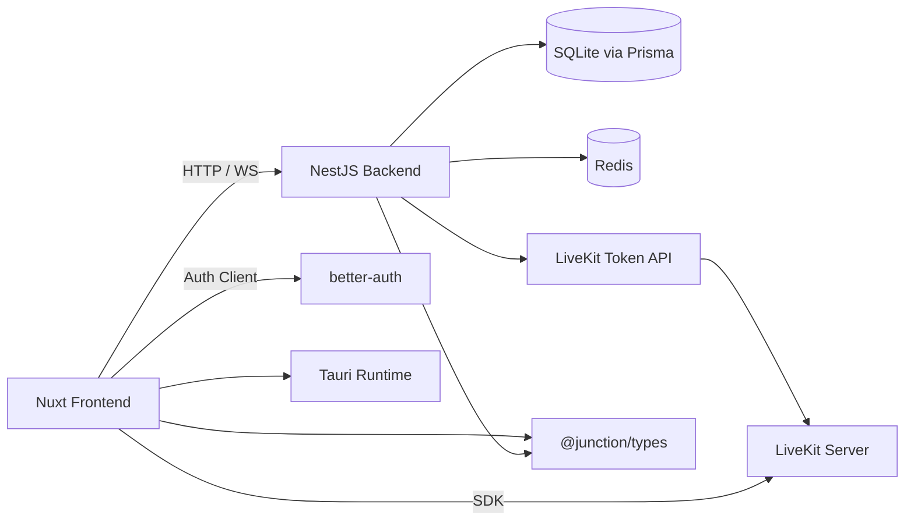
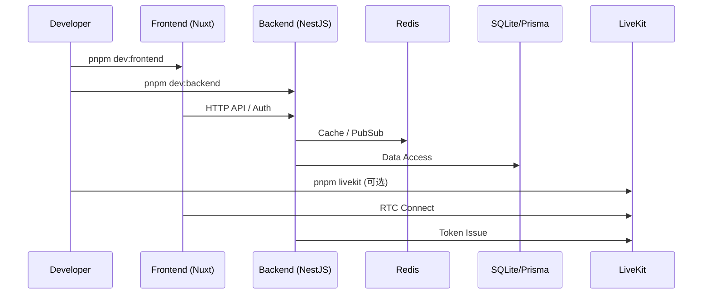

# Junction

<p align="center">
  面向即时通信与协作场景的全栈 Monorepo，提供聊天、实时通话、AI 助手与桌面化能力。
</p>

<p align="center">
  <a href="./LICENSE"></a>
  <a href="./package.json"></a>
  <a href="./turbo.json"></a>
  <a href="./pnpm-workspace.yaml"></a>
</p>

<p align="center">
  <code>Nuxt 4</code> · <code>NestJS</code> · <code>Prisma</code> · <code>Redis</code> · <code>better-auth</code> · <code>LiveKit</code> · <code>Tauri</code>
</p>
## 目录

- [1. 项目定位](#1-项目定位)
- [2. 核心能力](#2-核心能力)
- [3. 技术架构](#3-技术架构)
- [4. 仓库结构](#4-仓库结构)
- [5. 快速开始](#5-快速开始)
- [6. 环境变量](#6-环境变量)
- [7. 开发命令](#7-开发命令)
- [8. 认证与安全](#8-认证与安全)
- [9. 实时通话与 LiveKit](#9-实时通话与-livekit)
- [10. Tauri 桌面端](#10-tauri-桌面端)
- [11. API 与调试](#11-api-与调试)
- [12. 构建与部署建议](#12-构建与部署建议)
- [13. 开发规范](#13-开发规范)
- [14. 常见问题](#14-常见问题)
- [15. 贡献与支持](#15-贡献与支持)

## 1. 项目定位
Junction 是一个基于 **pnpm workspaces + Turborepo** 的全栈 Monorepo，聚焦以下目标：

- 为私聊、群聊、通知、实时通话提供一致体验
- 支持 Web 与桌面端（Tauri）双形态运行
- 在业务层复用统一 API、统一类型与统一状态管理
- 提供 AI Bot、富文本、文件能力等协作增强模块

## 2. 核心能力
| 能力域 | 说明 |
| --- | --- |
| 即时通信 | 私聊、群聊、临时会话、系统会话 |
| 消息系统 | 文本、图片、文件、音视频、表情、富文本、消息上下文 |
| 社交关系 | 好友申请、通过/拒绝、拉黑、备注 |
| 通知中心 | 系统通知、消息通知、好友请求、下载通知 |
| AI 能力 | AI Bot、文本生成、流式输出、可扩展模型提供方 |
| 实时通话 | 基于 LiveKit 的音视频/屏幕共享 |
| 多端支持 | Nuxt Web + Tauri Desktop |

## 3. 技术架构
### 3.1 技术栈
| 层级 | 技术 |
| --- | --- |
| 前端 | Nuxt 4、Vue 3、Pinia、Tailwind CSS、DaisyUI、Tauri |
| 后端 | NestJS、Prisma、Redis、Socket.IO、Swagger |
| 认证 | better-auth（邮箱、Passkey、SIWE 钱包） |
| 共享 | `@junction/types` |
| 基础设施 | LiveKit（自建） |

### 3.2 架构关系


### 3.3 启动链路


## 4. 仓库结构
```text
.
├─ apps
│  ├─ frontend          # Nuxt 4 + Tauri
│  └─ backend           # NestJS + Prisma + Redis
├─ packages
│  └─ types             # 共享类型包 @junction/types
├─ infra
│  └─ livekit           # LiveKit 自建配置
├─ AGENTS.md            # AI 协作规范
├─ turbo.json           # Turborepo 任务编排
└─ pnpm-workspace.yaml
```

## 5. 快速开始
### 5.1 前置要求
- Node.js 20+
- pnpm 10+
- Docker（可选，用于 LiveKit）
- Redis（本地或远程）

### 5.2 安装依赖
```bash
pnpm install
```

### 5.3 配置环境变量
复制根目录 `.env.example` 为 `.env` 并按需修改。

Linux/macOS:
```bash
cp .env.example .env
```

Windows PowerShell:
```powershell
Copy-Item .env.example .env
```

### 5.4 启动开发环境
```bash
pnpm dev
```

按需单独启动：
```bash
pnpm dev:frontend
pnpm dev:backend
```

默认访问地址：
- 前端：`http://localhost:3000`
- 后端：`http://localhost:8080`
- Swagger：`http://localhost:8080/swagger`

### 5.5 30 秒命令流
```bash
pnpm install
cp .env.example .env
pnpm dev
```

## 6. 环境变量
以下为当前仓库 `.env.example` 的主要字段分组。

### 6.1 应用与服务地址
| 变量 | 说明 | 示例 |
| --- | --- | --- |
| `NUXT_PUBLIC_APP_NAME` | 应用名称 | `Junction` |
| `NUXT_PUBLIC_HTTP_TYPE` | 协议 | `http` |
| `NUXT_PUBLIC_SERVER_HOST` | 服务主机名 | `localhost` |
| `NUXT_PUBLIC_FRONTEND_PORT` | 前端端口 | `3000` |
| `NUXT_PUBLIC_BACKEND_PORT` | 后端端口 | `8080` |
| `NUXT_PUBLIC_API_URL` | 前端请求后端基础地址 | `http://localhost:8080` |

### 6.2 认证
| 变量 | 说明 |
| --- | --- |
| `AUTH_SECRET` | better-auth 使用的密钥，生产环境必须设置强随机值 |

### 6.3 邮件
| 变量 | 说明 |
| --- | --- |
| `MAIL_HOST` | SMTP 服务器 |
| `MAIL_PORT` | SMTP 端口 |
| `MAIL_USER` | 邮箱账号 |
| `MAIL_PASS` | 邮箱授权码 |
| `MAIL_FROM` | 发件人地址 |

### 6.4 Redis
| 变量 | 说明 |
| --- | --- |
| `REDIS_HOST` | Redis 主机 |
| `REDIS_PORT` | Redis 端口 |
| `REDIS_PASSWORD` | Redis 密码 |
| `REDIS_DB` | Redis DB 索引 |

### 6.5 AI
| 变量 | 说明 |
| --- | --- |
| `NUXT_PUBLIC_AI_DEFAULT_PROVIDER` | 默认 AI 提供方 |
| `DEEPSEEK_API_KEY` | DeepSeek Key |
| `DEEPSEEK_API_BASE_URL` | DeepSeek Base URL |
| `DEEPSEEK_DEFAULT_MODEL` | DeepSeek 默认模型 |
| `AI_BOT_SECRET` | AI Bot 服务端密钥 |
| `AI_EMOJI_ENABLED` | 是否启用表情 AI 功能 |
| `AI_EMOJI_MODEL` | 表情分析模型 |
| `AI_EMOJI_PROMPT` | 表情分析提示词 |
| `AI_EMOJI_MAX_BYTES` | 表情处理最大字节数 |

### 6.6 实时通信
| 变量 | 说明 |
| --- | --- |
| `NUXT_PUBLIC_RTC_ICE_SERVERS` | RTC ICE 服务器 JSON |
| `NUXT_PUBLIC_LIVEKIT_URL` | 前端连接 LiveKit 地址 |
| `LIVEKIT_URL` | 后端签发 Token 使用的 LiveKit 地址 |
| `LIVEKIT_API_KEY` | LiveKit API Key |
| `LIVEKIT_API_SECRET` | LiveKit API Secret |

## 7. 开发命令
### 7.0 常用命令速查
```bash
# 一键开发
pnpm dev

# 分别启动
pnpm dev:frontend
pnpm dev:backend

# 构建与测试
pnpm build
pnpm -C apps/backend test
pnpm -C apps/backend test:e2e

# 启动 LiveKit
pnpm livekit
```

### 7.1 根目录
| 命令 | 说明 |
| --- | --- |
| `pnpm dev` | 并行启动前后端开发服务 |
| `pnpm dev:frontend` | 仅启动前端 |
| `pnpm dev:backend` | 仅启动后端 |
| `pnpm build` | 构建全部应用 |
| `pnpm build:packages` | 仅构建 `packages/*` |
| `pnpm livekit` | 启动 LiveKit Docker Compose |

### 7.2 前端（`apps/frontend`）
| 命令 | 说明 |
| --- | --- |
| `pnpm -C apps/frontend dev` | 本地开发 |
| `pnpm -C apps/frontend build` | 构建 Nuxt |
| `pnpm -C apps/frontend preview` | 预览构建结果 |
| `pnpm -C apps/frontend tauri` | Tauri CLI |
| `pnpm -C apps/frontend tauri:android` | Android 调试 |
| `pnpm -C apps/frontend tauri:android:build` | Android 构建 |

### 7.3 后端（`apps/backend`）
| 命令 | 说明 |
| --- | --- |
| `pnpm -C apps/backend dev` | 开发模式 |
| `pnpm -C apps/backend build` | 构建后端 |
| `pnpm -C apps/backend start` | 启动后端 |
| `pnpm -C apps/backend test` | 单元测试 |
| `pnpm -C apps/backend test:e2e` | E2E 测试 |
| `pnpm -C apps/backend lint` | ESLint 检查与修复 |

## 8. 认证与安全
Junction 当前认证体系基于 `better-auth`，支持以下方式：

- 邮箱密码与邮箱 OTP
- Passkey
- SIWE（以太坊钱包登录）

相关关键路径：
- 后端认证工厂：`apps/backend/src/utils/auth/index.ts`
- 前端认证客户端：`apps/frontend/app/core/auth/index.ts`
- 钱包登录页：`apps/frontend/app/pages/auth/index/sign-in/ethereum.vue`
- 个人档案钱包管理：`apps/frontend/app/pages/profile/index/security.vue`

钱包关联接口：
- `GET /user/wallets`
- `POST /user/wallets/nonce`
- `POST /user/wallets/bind`
- `PATCH /user/wallets/:walletId/primary`
- `DELETE /user/wallets/:walletId`

## 9. 实时通话与 LiveKit
### 9.1 接口与调用
- Token API：`POST /call/livekit/token`
- 前端调用：`apps/frontend/app/api/call.ts`
- 核心管理器：`apps/frontend/app/core/rtc/call-manager.ts`

### 9.2 自建部署
```bash
pnpm livekit
```

文件位置：
- `infra/livekit/docker-compose.yml`
- `infra/livekit/livekit.yaml`

默认端口：
- `7880`：HTTP/WebSocket
- `7881`：TCP
- `7882/udp`：UDP

## 10. Tauri 桌面端
前端已集成 Tauri 2.x，常用插件包括：
- `@tauri-apps/plugin-dialog`
- `@tauri-apps/plugin-fs`
- `@tauri-apps/plugin-http`

注意：
- 系统目录选择使用 Tauri Dialog
- UI 级提示与弹窗统一使用前端组件封装
- 权限配置位于 `apps/frontend/src-tauri/capabilities/default.json`

## 11. API 与调试
### 11.1 Swagger
- 访问地址：`http://localhost:8080/swagger`
- JSON：`http://localhost:8080/swagger/json`

### 11.2 CORS
后端已根据环境变量与常见开发域名配置 CORS 白名单，详见：
- `apps/backend/src/main.ts`

### 11.3 日志与状态
- 前端 API 日志封装：`apps/frontend/app/utils/logger.ts`
- 启动阶段逻辑：`apps/frontend/app/plugins/startup.client.ts`

## 12. 构建与部署建议
### 12.1 最小部署单元
- `apps/frontend`（Nuxt）
- `apps/backend`（NestJS）
- Redis 实例
- LiveKit（可选，但通话功能依赖）

### 12.2 推荐流程
1. 配置生产环境 `.env`
2. 构建项目：`pnpm build`
3. 启动后端：`pnpm -C apps/backend start:prod`
4. 部署前端产物（按 Nuxt 目标环境）
5. 启动 LiveKit（如需通话）

> [!NOTE]
> 当前仓库以 Monorepo 方式组织，部署时建议将 `apps/frontend` 与 `apps/backend` 分离发布，
> 并通过统一域名网关处理跨域与证书。

## 13. 开发规范
请在开发前先阅读：
- [AGENTS.md](./AGENTS.md)

关键约束（摘要）：
- 前端业务层禁止直接 `fetch/axios`，统一走 `apps/frontend/app/api/*`
- 公共类型优先复用 `@junction/types`
- 全局设置统一走 `useSettingsStore`
- 下载链路统一走 `apps/frontend/app/utils/download.ts`

## 14. 常见问题
### 14.1 前端启动后无法请求后端
- 检查 `.env` 中 `NUXT_PUBLIC_API_URL`
- 检查后端端口 `NUXT_PUBLIC_BACKEND_PORT`
- 检查 `apps/backend/src/main.ts` CORS 白名单

### 14.2 钱包登录失败
- 确认浏览器已安装并登录 MetaMask
- 确认链 ID 与地址一致
- 检查 `AUTH_SECRET` 是否正确配置

### 14.3 通话连接失败
- 确认 LiveKit 服务已启动
- 检查 `LIVEKIT_URL`、`LIVEKIT_API_KEY`、`LIVEKIT_API_SECRET`
- 确认 7880/7881/7882 端口可达

## 15. 贡献与支持
- 贡献规范：[`CONTRIBUTING.md`](./CONTRIBUTING.md)
- 行为准则：[`CODE_OF_CONDUCT.md`](./CODE_OF_CONDUCT.md)
- 安全策略：[`SECURITY.md`](./SECURITY.md)
- 支持说明：[`SUPPORT.md`](./SUPPORT.md)
- 变更记录：[`CHANGELOG.md`](./CHANGELOG.md)
