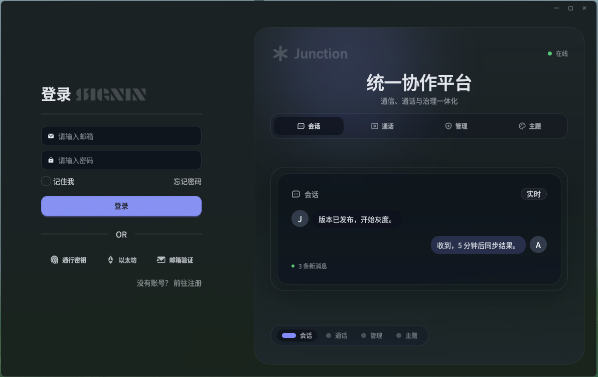
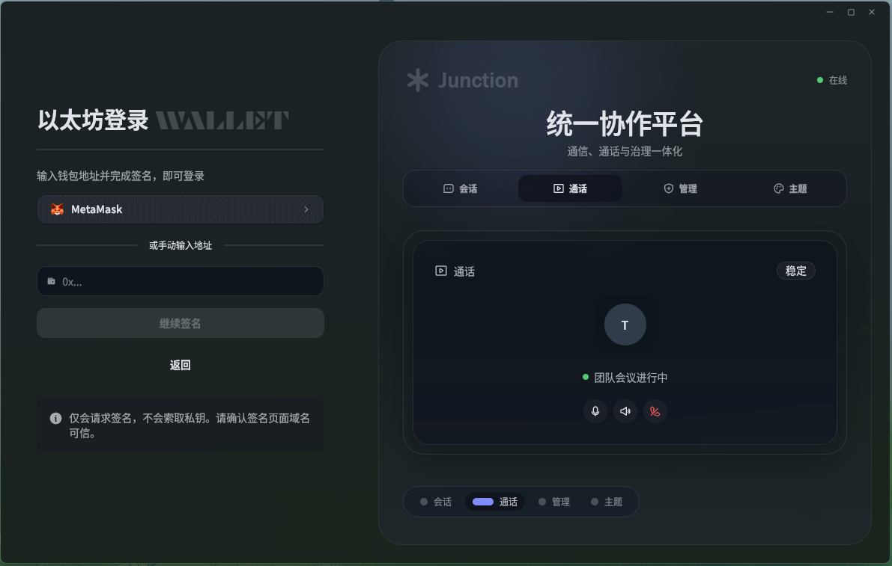
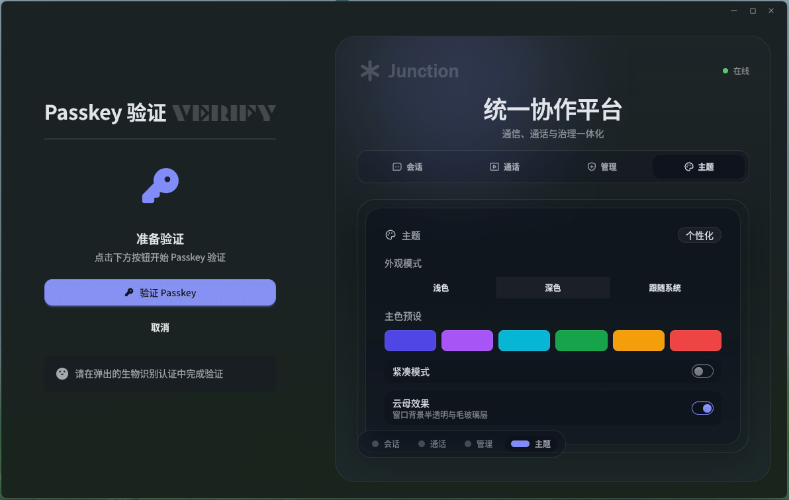
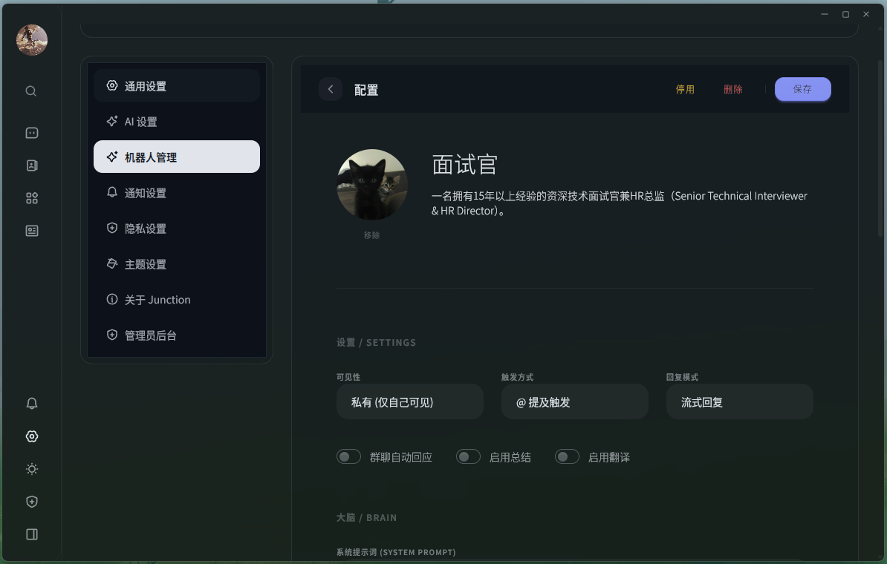
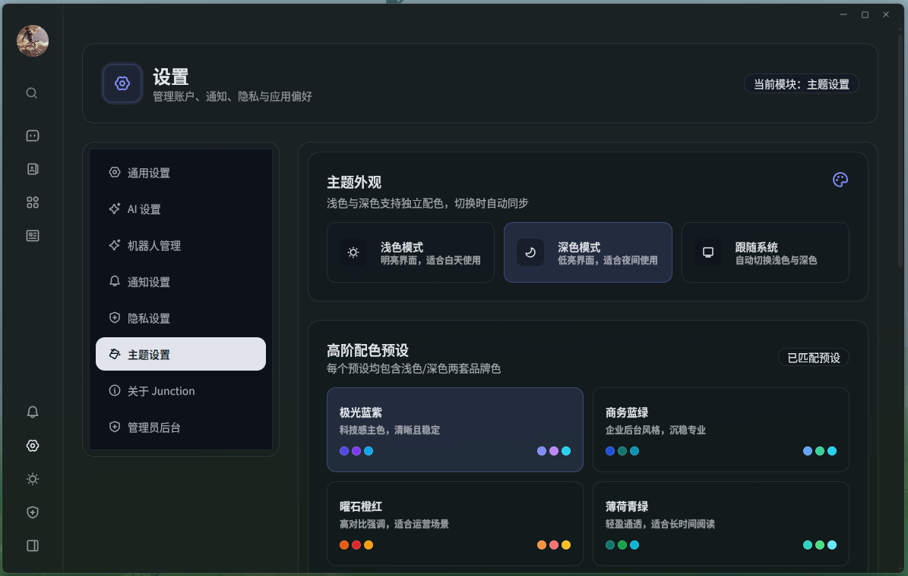
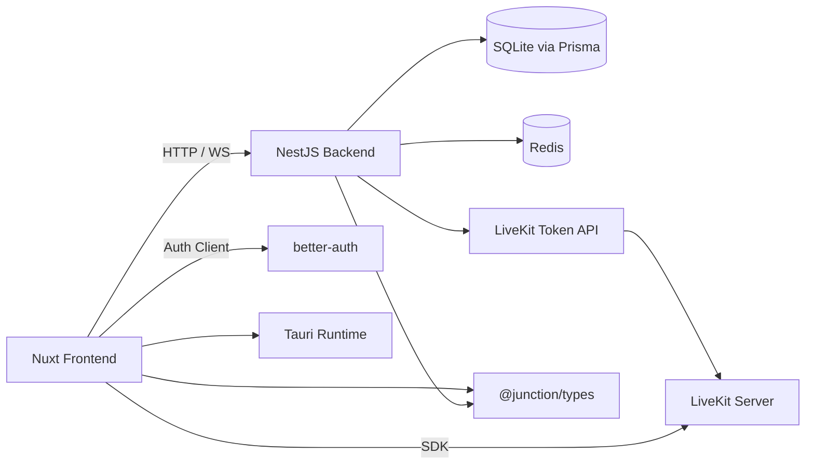
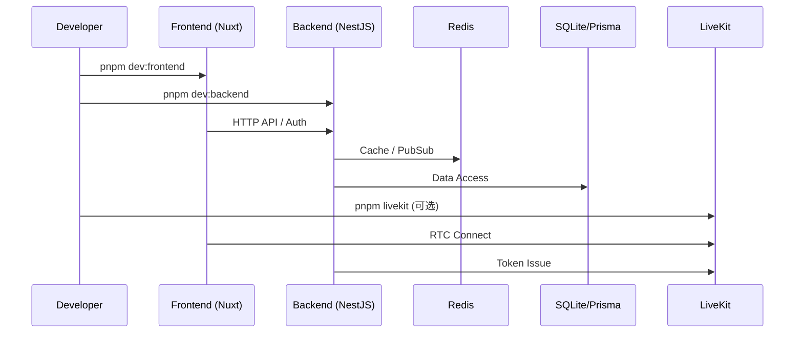

# Junction 基于Tauri的跨平台即时通信软件设计与实现

<p align="center">
  面向即时通信与协作场景的全栈 Monorepo，提供聊天、实时通话、AI 助手与桌面化能力。
</p>

<p align="center">
  <a href="./LICENSE"></a>
  <a href="./package.json"></a>
  <a href="./turbo.json"></a>
  <a href="./pnpm-workspace.yaml"></a>
</p>

<p align="center">
  <code>Nuxt 4</code> · <code>NestJS</code> · <code>Prisma</code> · <code>Redis</code> · <code>better-auth</code> · <code>LiveKit</code> · <code>Tauri</code>
</p>


## 目录

- [1. 项目定位](#1-项目定位)
- [2. 核心能力](#2-核心能力)
- [3. 技术架构](#3-技术架构)
- [4. 仓库结构](#4-仓库结构)
- [5. 快速开始](#5-快速开始)
- [6. 环境变量](#6-环境变量)
- [7. 开发命令](#7-开发命令)
- [8. 认证与安全](#8-认证与安全)
- [9. 实时通话与 LiveKit](#9-实时通话与-livekit)
- [10. Tauri 桌面端](#10-tauri-桌面端)
- [11. API 与调试](#11-api-与调试)
- [12. 构建与部署建议](#12-构建与部署建议)
- [13. 开发规范](#13-开发规范)
- [14. 常见问题](#14-常见问题)
- [15. 贡献与支持](#15-贡献与支持)

## 1. 项目定位
Junction 是一个基于 **pnpm workspaces + Turborepo** 的全栈 Monorepo，聚焦以下目标：

- 为私聊、群聊、通知、实时通话提供一致体验
- 支持 Web 与桌面端（Tauri）双形态运行
- 在业务层复用统一 API、统一类型与统一状态管理
- 提供 AI Bot、富文本、文件能力等协作增强模块













## 2. 核心能力

| 能力域 | 说明 |
| --- | --- |
| 即时通信 | 私聊、群聊、临时会话、系统会话 |
| 消息系统 | 文本、图片、文件、音视频、表情、富文本、消息上下文 |
| 社交关系 | 好友申请、通过/拒绝、拉黑、备注 |
| 通知中心 | 系统通知、消息通知、好友请求、下载通知 |
| AI 能力 | AI Bot、文本生成、流式输出、可扩展模型提供方 |
| 实时通话 | 基于 LiveKit 的音视频/屏幕共享 |
| 多端支持 | Nuxt Web + Tauri Desktop |

## 3. 技术架构
### 3.1 技术栈
| 层级 | 技术 |
| --- | --- |
| 前端 | Nuxt 4、Vue 3、Pinia、Tailwind CSS、DaisyUI、Tauri |
| 后端 | NestJS、Prisma、Redis、Socket.IO、Swagger |
| 认证 | better-auth（邮箱、Passkey、SIWE 钱包） |
| 共享 | `@junction/types` |
| 基础设施 | LiveKit（自建） |

### 3.2 架构关系

```mermaid
flowchart LR
  A[Nuxt Frontend] -->|HTTP / WS| B[NestJS Backend]
  A -->|Auth Client| C[better-auth]
  B --> D[(SQLite via Prisma)]
  B --> E[(Redis)]
  B --> F[LiveKit Token API]
  F --> G[LiveKit Server]
  A -->|SDK| G
  A --> H[Tauri Runtime]
  A --> ITypes["@junction/types"]
  B --> ITypes
```

### 3.3 启动链路

```mermaid
sequenceDiagram
  participant Dev as Developer
  participant FE as Frontend (Nuxt)
  participant BE as Backend (NestJS)
  participant RD as Redis
  participant DB as SQLite/Prisma
  participant LK as LiveKit

  Dev->>FE: pnpm dev:frontend
  Dev->>BE: pnpm dev:backend
  FE->>BE: HTTP API / Auth
  BE->>RD: Cache / PubSub
  BE->>DB: Data Access
  Dev->>LK: pnpm livekit (可选)
  FE->>LK: RTC Connect
  BE->>LK: Token Issue
```

## 4. 仓库结构
```text
.
├─ apps
│  ├─ frontend          # Nuxt 4 + Tauri
│  └─ backend           # NestJS + Prisma + Redis
├─ packages
│  └─ types             # 共享类型包 @junction/types
├─ infra
│  └─ livekit           # LiveKit 自建配置
├─ AGENTS.md            # AI 协作规范
├─ turbo.json           # Turborepo 任务编排
└─ pnpm-workspace.yaml
```

## 5. 快速开始
### 5.1 前置要求
- Node.js 20+
- pnpm 10+
- Docker（可选，用于 LiveKit）
- Redis（本地或远程）

### 5.2 安装依赖
```bash
pnpm install
```

### 5.3 配置环境变量
复制根目录 `.env.example` 为 `.env` 并按需修改。

Linux/macOS:
```bash
cp .env.example .env
```

Windows PowerShell:
```powershell
Copy-Item .env.example .env
```

### 5.4 启动开发环境
```bash
pnpm dev
```

按需单独启动：
```bash
pnpm dev:frontend
pnpm dev:backend
```

默认访问地址：
- 前端：`http://localhost:3000`
- 后端：`http://localhost:8080`
- Swagger：`http://localhost:8080/swagger`

### 5.5 30 秒命令流
```bash
pnpm install
cp .env.example .env
pnpm dev
```

## 6. 环境变量
以下为当前仓库 `.env.example` 的主要字段分组。

### 6.1 应用与服务地址
| 变量 | 说明 | 示例 |
| --- | --- | --- |
| `NUXT_PUBLIC_APP_NAME` | 应用名称 | `Junction` |
| `NUXT_PUBLIC_HTTP_TYPE` | 协议 | `http` |
| `NUXT_PUBLIC_SERVER_HOST` | 服务主机名 | `localhost` |
| `NUXT_PUBLIC_FRONTEND_PORT` | 前端端口 | `3000` |
| `NUXT_PUBLIC_BACKEND_PORT` | 后端端口 | `8080` |

### 6.2 认证
| 变量 | 说明 |
| --- | --- |
| `AUTH_SECRET` | better-auth 使用的密钥，生产环境必须设置强随机值 |

### 6.3 邮件
| 变量 | 说明 |
| --- | --- |
| `MAIL_HOST` | SMTP 服务器 |
| `MAIL_PORT` | SMTP 端口 |
| `MAIL_USER` | 邮箱账号 |
| `MAIL_PASS` | 邮箱授权码 |
| `MAIL_FROM` | 发件人地址 |

### 6.4 Redis
| 变量 | 说明 |
| --- | --- |
| `REDIS_HOST` | Redis 主机 |
| `REDIS_PORT` | Redis 端口 |
| `REDIS_PASSWORD` | Redis 密码 |
| `REDIS_DB` | Redis DB 索引 |

### 6.5 AI
| 变量 | 说明 |
| --- | --- |
| `NUXT_PUBLIC_AI_DEFAULT_PROVIDER` | 默认 AI 提供方 |
| `DEEPSEEK_API_KEY` | DeepSeek Key |
| `DEEPSEEK_API_BASE_URL` | DeepSeek Base URL |
| `DEEPSEEK_DEFAULT_MODEL` | DeepSeek 默认模型 |
| `AI_BOT_SECRET` | AI Bot 服务端密钥 |
| `AI_EMOJI_ENABLED` | 是否启用表情 AI 功能 |
| `AI_EMOJI_MODEL` | 表情分析模型 |
| `AI_EMOJI_PROMPT` | 表情分析提示词 |
| `AI_EMOJI_MAX_BYTES` | 表情处理最大字节数 |

### 6.6 实时通信
| 变量 | 说明 |
| --- | --- |
| `NUXT_PUBLIC_RTC_ICE_SERVERS` | RTC ICE 服务器 JSON |
| `LIVEKIT_PORT` | LiveKit 服务端口（默认 `7880`） |
| `LIVEKIT_API_KEY` | LiveKit API Key |
| `LIVEKIT_API_SECRET` | LiveKit API Secret |

## 7. 开发命令
### 7.0 常用命令速查
```bash
# 一键开发
pnpm dev

# 分别启动
pnpm dev:frontend
pnpm dev:backend

# 构建与测试
pnpm build
pnpm -C apps/backend test
pnpm -C apps/backend test:e2e

# 启动 LiveKit
pnpm livekit
```

### 7.1 根目录
| 命令 | 说明 |
| --- | --- |
| `pnpm dev` | 并行启动前后端开发服务 |
| `pnpm dev:frontend` | 仅启动前端 |
| `pnpm dev:backend` | 仅启动后端 |
| `pnpm build` | 构建全部应用 |
| `pnpm build:packages` | 仅构建 `packages/*` |
| `pnpm livekit` | 启动 LiveKit Docker Compose |

### 7.2 前端（`apps/frontend`）
| 命令 | 说明 |
| --- | --- |
| `pnpm -C apps/frontend dev` | 本地开发 |
| `pnpm -C apps/frontend build` | 构建 Nuxt |
| `pnpm -C apps/frontend preview` | 预览构建结果 |
| `pnpm -C apps/frontend tauri` | Tauri CLI |
| `pnpm -C apps/frontend tauri:android` | Android 调试 |
| `pnpm -C apps/frontend tauri:android:build` | Android 构建 |

### 7.3 后端（`apps/backend`）
| 命令 | 说明 |
| --- | --- |
| `pnpm -C apps/backend dev` | 开发模式 |
| `pnpm -C apps/backend build` | 构建后端 |
| `pnpm -C apps/backend start` | 启动后端 |
| `pnpm -C apps/backend test` | 单元测试 |
| `pnpm -C apps/backend test:e2e` | E2E 测试 |
| `pnpm -C apps/backend lint` | ESLint 检查与修复 |

## 8. 认证与安全
Junction 当前认证体系基于 `better-auth`，支持以下方式：

- 邮箱密码与邮箱 OTP
- Passkey
- SIWE（以太坊钱包登录）

相关关键路径：
- 后端认证工厂：`apps/backend/src/utils/auth/index.ts`
- 前端认证客户端：`apps/frontend/app/core/auth/index.ts`
- 钱包登录页：`apps/frontend/app/pages/auth/index/sign-in/ethereum.vue`
- 个人档案钱包管理：`apps/frontend/app/pages/profile/index/security.vue`

钱包关联接口：
- `GET /user/wallets`
- `POST /user/wallets/nonce`
- `POST /user/wallets/bind`
- `PATCH /user/wallets/:walletId/primary`
- `DELETE /user/wallets/:walletId`

## 9. 实时通话与 LiveKit
### 9.1 接口与调用
- Token API：`POST /call/livekit/token`
- 前端调用：`apps/frontend/app/api/call.ts`
- 核心管理器：`apps/frontend/app/core/rtc/call-manager.ts`

### 9.2 自建部署
```bash
pnpm livekit
```

文件位置：
- `infra/livekit/docker-compose.yml`
- `infra/livekit/livekit.yaml`

默认端口：
- `7880`：HTTP/WebSocket
- `7881`：TCP
- `7882/udp`：UDP

## 10. Tauri 桌面端
前端已集成 Tauri 2.x，常用插件包括：
- `@tauri-apps/plugin-dialog`
- `@tauri-apps/plugin-fs`
- `@tauri-apps/plugin-http`

注意：
- 系统目录选择使用 Tauri Dialog
- UI 级提示与弹窗统一使用前端组件封装
- 权限配置位于 `apps/frontend/src-tauri/capabilities/default.json`

## 11. API 与调试
### 11.1 Swagger
- 访问地址：`http://localhost:8080/swagger`
- JSON：`http://localhost:8080/swagger/json`

### 11.2 CORS
后端已根据环境变量与常见开发域名配置 CORS 白名单，详见：
- `apps/backend/src/main.ts`

### 11.3 日志与状态
- 前端 API 日志封装：`apps/frontend/app/utils/logger.ts`
- 启动阶段逻辑：`apps/frontend/app/plugins/startup.client.ts`

## 12. 构建与部署建议
### 12.1 最小部署单元
- `apps/frontend`（Nuxt）
- `apps/backend`（NestJS）
- Redis 实例
- LiveKit（可选，但通话功能依赖）

### 12.2 推荐流程
1. 配置生产环境 `.env`
2. 构建项目：`pnpm build`
3. 启动后端：`pnpm -C apps/backend start:prod`
4. 部署前端产物（按 Nuxt 目标环境）
5. 启动 LiveKit（如需通话）

> [!NOTE]
> 当前仓库以 Monorepo 方式组织，部署时建议将 `apps/frontend` 与 `apps/backend` 分离发布，
> 并通过统一域名网关处理跨域与证书。

## 13. 开发规范
请在开发前先阅读：
- [AGENTS.md](./AGENTS.md)

关键约束（摘要）：
- 前端业务层禁止直接 `fetch/axios`，统一走 `apps/frontend/app/api/*`
- 公共类型优先复用 `@junction/types`
- 全局设置统一走 `useSettingsStore`
- 下载链路统一走 `apps/frontend/app/utils/download.ts`

## 14. 常见问题
### 14.1 前端启动后无法请求后端
- 检查 `.env` 中 `NUXT_PUBLIC_SERVER_HOST` 与 `NUXT_PUBLIC_BACKEND_PORT`
- 检查后端端口 `NUXT_PUBLIC_BACKEND_PORT`
- 检查 `apps/backend/src/main.ts` CORS 白名单

### 14.2 钱包登录失败
- 确认浏览器已安装并登录 MetaMask
- 确认链 ID 与地址一致
- 检查 `AUTH_SECRET` 是否正确配置

### 14.3 通话连接失败
- 确认 LiveKit 服务已启动
- 检查 `NUXT_PUBLIC_SERVER_HOST`、`LIVEKIT_PORT`、`LIVEKIT_API_KEY`、`LIVEKIT_API_SECRET`
- 确认 7880/7881/7882 端口可达

## 15. 贡献与支持
- 贡献规范：[`CONTRIBUTING.md`](./CONTRIBUTING.md)
- 行为准则：[`CODE_OF_CONDUCT.md`](./CODE_OF_CONDUCT.md)
- 安全策略：[`SECURITY.md`](./SECURITY.md)
- 支持说明：[`SUPPORT.md`](./SUPPORT.md)
- 变更记录：[`CHANGELOG.md`](./CHANGELOG.md)

## 16. LiveKit
无需再修改 `infra/livekit/docker-compose.yml` 或 `infra/livekit/livekit.yaml` 中的 IP。

启动命令：

```bash
pnpm livekit:up
```

常用命令：

```bash
pnpm livekit:up
pnpm livekit:down
pnpm livekit:restart
pnpm livekit:logs
```

IP 读取优先级：

1. `LIVEKIT_NODE_IP`
2. `NUXT_PUBLIC_SERVER_HOST`
3. `127.0.0.1`

建议在根目录 `.env` 中维护：

```env
NUXT_PUBLIC_SERVER_HOST=10.153.176.133
LIVEKIT_NODE_IP=
```
# 开题报告

1.研究目的及意义（国内外研究现状概述）
随着互联网应用的普及与通信需求的多样化，即时通信（Instant Messaging，简称IM）软件已成为人们日常生活与工作中不可或缺的工具。从最早的桌面端聊天程序到如今跨设备、跨平台的综合通信系统，软件架构与开发技术经历了显著的演进。然而，当前主流即时通信软件普遍依赖于特定平台生态（如Windows、macOS、Android、iOS等），跨平台一致性和性能仍然存在不足。例如，Electron等框架虽然实现了较高的跨平台兼容性，但其体积庞大、资源占用高、启动速度慢，难以满足轻量化与高性能的需求。
近年来，Tauri框架的出现为桌面跨平台应用开发提供了新的方向。Tauri以Rust作为后端核心，通过调用系统原生WebView渲染前端页面，实现了极低的内存占用与极高的安全性。同时，它支持前端框架如Nuxt、React、Vue等的无缝集成，为构建现代化、高性能的桌面通信软件提供了坚实的基础。
本课题旨在基于Tauri框架，设计并实现一款跨平台即时通信软件，结合Nuxt3、NestJS、Prisma等现代技术栈，构建一个具备用户认证、加密通信、AI对话的系统。该系统将支持Windows、Android以及Web多平台运行，提供统一的使用体验。
研究本课题具有以下几方面意义：
（1）技术层面：通过探索Tauri在跨平台即时通信场景中的可行性，为轻量化、高性能桌面应用的开发提供技术参考；
（2）应用层面：实现集成式通信、AI对话与多模块扩展的统一平台，提升用户的跨设备沟通与协作体验；
（3）教育与研究层面：对现代前后端分离架构、全栈通信协议、身份认证体系的研究与实现具有实践指导意义；
（4）社会层面：为中小型团队或个人开发者提供一种低成本、高安全的通信解决方案，推动开源生态的发展。
总体来看，本课题在即时通信系统的跨平台性能优化、模块化设计及安全通信机制等方面具有较高的研究价值与应用前景。
目前，国际上主流即时通信系统主要分为两类：一类是以Telegram、Signal为代表的去中心化、高加密通信软件；另一类是以WhatsApp、Discord、Slack为代表的综合型社交与协作工具。它们在消息加密、文件传输、插件生态等方面均已形成较为完善的体系。
在国内，微信、QQ、飞书、钉钉等应用在即时通信领域占据主导地位。它们在系统集成度与用户体验上表现优异，但普遍依赖于封闭平台生态，且跨平台兼容性与资源效率仍有改进空间。
从技术趋势看，Electron在过去数年内是跨平台应用的主流方案，但其高内存占用与安全隐患逐渐受到关注。Tauri的出现代表了轻量化跨平台开发的新方向。国外已有部分项目（如Lapce、Ajour）采用Tauri构建高性能桌面端应用，但在即时通信领域的应用仍较少，相关研究尚处于起步阶段。
国内目前对Tauri框架的研究主要集中于界面开发和性能测试，对基于Tauri的全栈通信系统设计的探索较少。因此，本课题在结合Tauri、Nuxt、NestJS与Prisma 的综合实现上，具有一定创新性和研究价值。

2.研究的基本内容、目标
本课题的主要研究内容包括以下几个方面：
1.系统架构设计：采用monorepo架构，将前端（Nuxt4+Tauri2）与后端（NestJS +Prisma+SQLite）模块化管理，实现高内聚、低耦合的工程结构。前后端通信采用RESTful api处理业务请求，使用WebSocket实现实时事件推送。 
2.用户认证与安全机制：基于邮箱验证码、密码、Passkey和以太坊钱包登录等多重身份认证方式，实现用户安全注册与访问控制。强制使用邮箱验证码进行验证，防止恶意用户批量创建账号。
3.好友系统：实现好友请求、同意、拒绝、拉黑、删除、备注等功能，使用Socket实时通知与在线状态显示。
4.对话模块：实现私聊、群聊、聊天室元数据管理等功能。
5.即时通信模块：通过WebSocket实现实时文本、图片、视频、文件、emoji等消息传输功能，并支持消息加密、历史记录同步、消息撤回和删除。
6.AI功能集成：对接AI服务，实现智能对话、内容总结等功能，增强系统的智能化水平。
7.多平台兼容与界面设计：通过TailwindCSS+DaisyUI实现响应式界面与主题切换，实现深色和浅色模式，自定义主题扩展，确保在各平台上视觉与交互一致。良好的动画效果，过渡自然流畅。
8.系统管理功能：管理员可进行用户封禁、系统通知等操作，保证系统的安全与稳定运行。
研究目标是开发一套功能完整、性能优异、安全可靠的跨平台即时通信软件原型系统。

3.拟采取的研究方法（技术方案及措施）
在技术方案上，本课题采用前后端分离与多端统一的开发思路：
前端部分使用Nuxt4+Tauri2作为主框架，以TypeScript为核心语言。Nuxt提供服务端渲染与组件化能力，Tauri提供原生桌面封装。通过Pinia管理全局状态，Axios 负责与后端通信。界面层采用TailwindCSS与DaisyUI构建响应式UI，并实现明暗主题切换。
后端基于NestJS框架构建，采用模块化设计思想。数据层使用Prisma ORM连接SQLite数据库，通过Zod Schema进行类型校验与数据验证。
即时通信功能通过Socket.IO实现，支持消息持久化与状态同步。
用户认证模块集成Better Auth框架，支持邮箱验证码、密码、Passkey、OAuth（以太坊登录）等多种方式，所有通信过程采用加密存储机制。
通过开放API（如OpenAI、Claude、Deepseek）实现智能对话与辅助功能，后续可模块化扩展更多AI工具。
该方案注重系统可维护性与可扩展性，保证项目能够适应多端部署与功能迭代需求。

4.进度安排
时间节点	任务内容
2025.11.1–2025.11.24	完成选题、文献调研、开题报告撰写
2025.11.25–2026.1.10	系统需求分析与总体架构设计
2026.1.11–2026.2.28	后端环境搭建、数据库设计与接口实现
2026.3.1–2026.3.30	前端界面设计与主要功能开发
2026.4.1–2026.4.7	中期检查，完善通信与AI模块
2026.4.8–2026.5.8	系统测试、性能优化与论文撰写
2026.5.9–2026.5.23	查重修改、论文答辩准备与最终提交

5.研究条件和可能存在的问题
本项目开发所需条件较为完备：
硬件条件：个人电脑具备Node.js、Rust、SQLite运行环境，支持多端测试。
软件条件：已安装pnpm、Nuxt、NestJS、Prisma、Tauri等主要依赖；开发工具包括VSCode、Git、Postman。
资料条件：查阅Tauri、NestJS、Prisma、AI接口文档及相关开源项目源码，可充分支撑研究工作。
可能存在的问题包括：
1.Tauri在移动端支持尚不完善，可能导致部分功能兼容性问题；
2.Socket通信的稳定性需要进一步测试与优化；
3.项目功能复杂，开发周期较长，需要合理控制模块范围与时间安排。
为解决上述问题，将在开发中采用模块化设计、预留扩展接口，并通过Mock数据进行阶段性测试，确保系统稳定性。

6.重点难点
研究重点包括以下几方面：
1.	基于Tauri的跨平台通信架构设计；
2.	实时通信的性能优化与消息同步机制；
3.	多重用户认证与加密技术的实现；
4.	AI模块的集成与系统资源管理。
主要难点在于：
1.	模块化插件系统的动态加载与隔离；
2.	多平台打包与原生功能调用（如通知、剪贴板、窗口管理）。
本研究将重点突破Tauri框架下即时通信的性能与安全问题，探索适用于轻量化跨平台系统的最佳实现路径。

7.预期结果和成果形式
预期将完成一套可运行的跨平台即时通信软件原型系统，实现以下功能：
1.	注册、登录、身份认证与权限控制；
2.	实时消息通信、文件传输与系统通知；
3.	AI助手模块；
4.	模块化系统与多端主题界面。
成果形式：一套可运行的多平台桌面应用（Tauri安装包或程序）、可运行的Nest后端；
通过本课题的研究与实现，期望提升对现代全栈架构、跨平台应用开发及即时通信系统设计的理解与实践能力，为今后从事系统开发与研究奠定坚实基础。

8.参考文献
[1]章晨曦.基于组件化的后台管理页面可视化构建系统设计与实现[D].北京邮电大学,2021.
[2]钟育伙.WebRTC的实时会议系统设计与实现[J].福建电脑,2025,41(04):80-84.
[3]孔席元.端到端加密聊天方案的设计与研究[D].华中师范大学,2019.
[4]邓安拓.混合架构WebRTC多方视频电话会议系统优化设计[D].广西民族大学,2023.
[5]周健.基于Node.js和WebRTC的智能制造服务平台的设计与实现[D].南昌大学,2024.
[6]贾鹏.基于大语言模型的农业知识问答系统的研究与设计[D].河北科技师范学院,2024.
[7]刘冬.基于智能手机的用户认证和安全设备配对技术研究[D].武汉大学,2018.
[8]浪潮卓数大数据产业发展有限公司.一种基于Monorepo架构的集成方法及系统:202510046411.2[P].2025-04-18.
[9]葛文博.基于Web的插件式可扩展视频直播系统的设计与实现[D].北京邮电大学,2023.
[10]李兴盛.基于WebRTC的实时通信系统的研究与实现[D].南昌大学,2017.
[11]黄阳.一个跨平台的移动应用开发和运行支撑平台的研究与实现[D].南京大学,2013.
[12]Kareem D ,Mahmoud B .Nuxt 3 Projects:Build scalable applications with Nuxt 3 using TypeScript, Pinia, and Composition API[M].Packt Publishing Limited:2024-06-21.
[13]Tiam L K .Hands-on Nuxt.js Web Development:Build universal and static-generated Vue.js applications using Nuxt.js[M].Packt Publishing Limited:2020-08-14.
[14]Pacifique L .Scalable Application Development with NestJS:Leverage REST, GraphQL, microservices, testing, and deployment for seamless growth[M].Packt Publishing Limited:2025-01-03.
[15]Sebastien D ,Alexis G .Learn TypeScript 3 by Building Web Applications:Gain a solid understanding of TypeScript, Angular, Vue, React, and NestJS[M].Packt Publishing Limited:2019-11-22.

# 任务书

一、设计主要内容
本课题旨在设计与实现一款支持多平台运行的即时通信软件。软件应当具备跨平台、高安全性和高扩展性的特征，能够在Windows、Web、Android操作系统上提供一致的用户体验。系统以消息交流为核心，结合用户身份管理、加密通信、AI对话、智能辅助等多项功能，构建一个集通讯与智能交互于一体的综合通信平台。
设计内容包括：系统总体架构设计、用户界面与交互流程设计、消息传输逻辑与数据管理机制设计、AI对话功能设计，以及系统整体运行流程的功能验证与性能评估。设计应体现现代通信软件的人机交互特征与系统可靠性要求。

二、完成的主要任务及要求
学生需独立完成系统的整体规划、功能实现与界面设计，形成一套功能完整、结构清晰的即时通信软件原型。系统应实现以下主要功能：
1.	用户系统功能：实现用户注册、登录、身份验证与个人资料管理，支持多种认证方式，确保用户信息安全与访问控制。
2.	好友系统：实现好友请求、同意、拒绝、拉黑、删除、备注等功能，使用Socket实时通知与在线状态显示。
3.	对话模块：实现私聊、群聊、聊天室元数据管理等功能。
4.	即时消息功能：支持实时的文本、图片、文件等消息发送与接收，具备消息记录保存、已读状态显示及消息加密传输功能。
5.	AI功能集成：对接AI服务，实现智能对话、内容总结等功能
6.	多平台兼容与界面设计：实现响应式界面与主题切换，实现深色和浅色模式，确保在各平台上视觉与交互一致。良好的动画效果，过渡自然流畅。
7.	多平台兼容功能：软件应在多个操作系统平台上保持一致的界面与交互逻辑，保证跨平台运行的稳定性与性能。
8.	系统管理功能：实现基础的系统设置、通知推送与管理员管理模块，确保系统运行安全与维护可控。
在设计过程中，要求学生注重系统的逻辑结构、交互体验与功能完整性，形成可展示的运行成果，并撰写配套的毕业设计说明书与技术文档。作品应体现出对即时通信系统功能体系与软件设计方法的综合理解。

三、完成任务的时间节点
2025年10月24日—2025年11月3日：指导老师与学生见面沟通，进行选题指导，确定选题。
2025年11月4日—2025年11月7日：指导教师下达任务书。
2025年11月8日—2025年11月23日：查阅参考文献，形成设计方案，撰写开题报告并完成开题。
2025年11月29日—2026年4月2日：完成设计框架和实验数据，撰写设计说明书初稿。
2026年4月3日—2026年4月7日：进行中期检查，并在老师指导下完善设计并修改设计说明书。
2026年4月8日—2026年4月30日：完成总体框架设计及各功能模块设计，调试代码，测试数据。
2026年5月1日—2026年5月8日：完成设计说明书定稿，进行重合比检测。
2026年5月9日—2026年5月23日：将毕业设计提交指导教师评审，完成毕业设计（论文）答辩。

四、必读参考文献
[1]章晨曦.基于组件化的后台管理页面可视化构建系统设计与实现[D].北京邮电大学,2021.
[2]钟育伙.WebRTC的实时会议系统设计与实现[J].福建电脑,2025,41(04):80-84.
[3]孔席元.端到端加密聊天方案的设计与研究[D].华中师范大学,2019.
[4]邓安拓.混合架构WebRTC多方视频电话会议系统优化设计[D].广西民族大学,2023.
[5]周健.基于Node.js和WebRTC的智能制造服务平台的设计与实现[D].南昌大学,2024.
[6]贾鹏.基于大语言模型的农业知识问答系统的研究与设计[D].河北科技师范学院,2024.
[7]刘冬.基于智能手机的用户认证和安全设备配对技术研究[D].武汉大学,2018.
[8]浪潮卓数大数据产业发展有限公司.一种基于Monorepo架构的集成方法及系统:202510046411.2[P].2025-04-18.
[9]葛文博.基于Web的插件式可扩展视频直播系统的设计与实现[D].北京邮电大学,2023.
[10]李兴盛.基于WebRTC的实时通信系统的研究与实现[D].南昌大学,2017.
[11]黄阳.一个跨平台的移动应用开发和运行支撑平台的研究与实现[D].南京大学,2013.
[12]Kareem D ,Mahmoud B .Nuxt 3 Projects:Build scalable applications with Nuxt 3 using TypeScript, Pinia, and Composition API[M].Packt Publishing Limited:2024-06-21.
[13]Tiam L K .Hands-on Nuxt.js Web Development:Build universal and static-generated Vue.js applications using Nuxt.js[M].Packt Publishing Limited:2020-08-14.
[14]Pacifique L .Scalable Application Development with NestJS:Leverage REST, GraphQL, microservices, testing, and deployment for seamless growth[M].Packt Publishing Limited:2025-01-03.
[15]Sebastien D ,Alexis G .Learn TypeScript 3 by Building Web Applications:Gain a solid understanding of TypeScript, Angular, Vue, React, and NestJS[M].Packt Publishing Limited:2019-11-22.
