# 系统图表

本文档包含即时通信系统的架构图、用例图和时序图，用于论文的第四章系统总体设计和第三章系统需求分析部分。

## 1 系统架构图

### 1.1 整体技术架构图

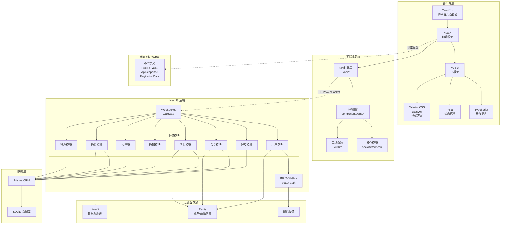

### 1.2 系统部署架构图

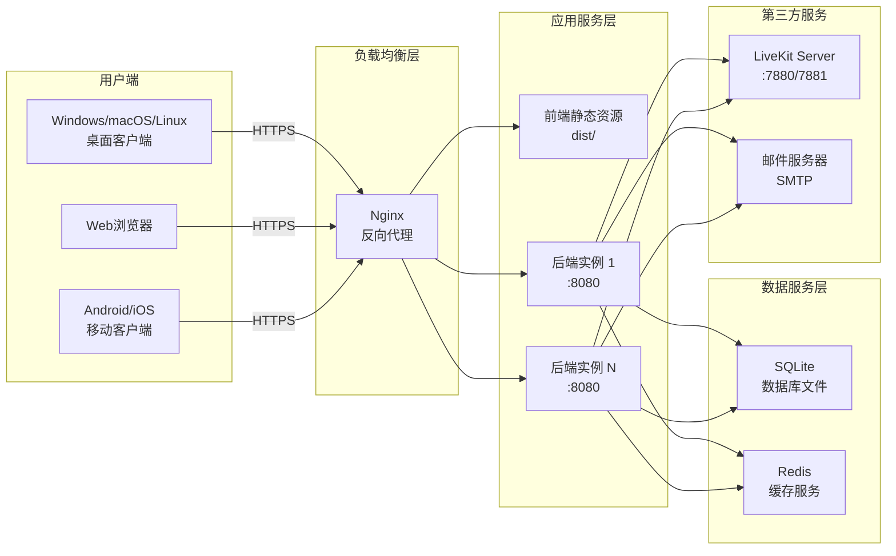

---

## 2 系统用例图

### 2.1 总体用例图

```mermaid
graph TB
    subgraph 普通用户
        UC1["用户注册"]
        UC2["用户登录"]
        UC3["个人信息管理"]
        UC4["钱包管理"]
        UC5["搜索用户"]
        UC6["添加好友"]
        UC7["处理好友请求"]
        UC8["好友列表管理"]
        UC9["黑名单管理"]
        UC10["创建私聊会话"]
        UC11["创建群聊会话"]
        UC12["会话列表查看"]
        UC13["会话设置管理"]
        UC14["发送消息"]
        UC15["接收消息"]
        UC16["消息历史查看"]
        UC17["消息编辑"]
        UC18["消息撤回"]
        UC19["消息删除"]
        UC20["消息搜索"]
        UC21["查看通知"]
        UC22["处理通知"]
        UC23["AI对话"]
        UC24["创建AI机器人"]
        UC25["发起语音通话"]
        UC26["发起视频通话"]
        UC27["通话控制"]
    end

    subgraph 群主
        UC28["任命管理员"]
        UC29["撤销管理员"]
        UC30["移除群成员"]
        UC31["修改群信息"]
        UC32["群主转让"]
        UC33["解散群聊"]
    end

    subgraph 管理员
        UC34["用户管理"]
        UC35["用户封禁/解封"]
        UC36["查看系统日志"]
        UC37["数据治理"]
        UC38["发布系统通知"]
    end

    用户 --> UC1
    用户 --> UC2
    用户 --> UC3
    用户 --> UC4
    用户 --> UC5
    用户 --> UC6
    用户 --> UC7
    用户 --> UC8
    用户 --> UC9
    用户 --> UC10
    用户 --> UC11
    用户 --> UC12
    用户 --> UC13
    用户 --> UC14
    用户 --> UC15
    用户 --> UC16
    用户 --> UC17
    用户 --> UC18
    用户 --> UC19
    用户 --> UC20
    用户 --> UC21
    用户 --> UC22
    用户 --> UC23
    用户 --> UC24
    用户 --> UC25
    用户 --> UC26
    用户 --> UC27

    群主 -.->|继承| 用户
    群主 --> UC28
    群主 --> UC29
    群主 --> UC30
    群主 --> UC31
    群主 --> UC32
    群主 --> UC33

    管理员 -.->|继承| 用户
    管理员 --> UC34
    管理员 --> UC35
    管理员 --> UC36
    管理员 --> UC37
    管理员 --> UC38
```

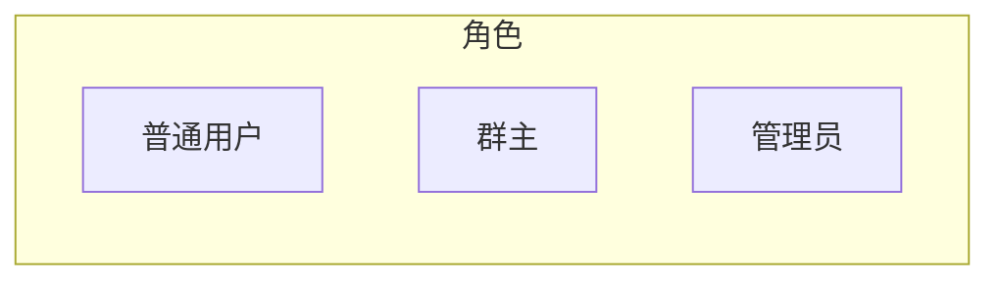

### 2.2 核心用例详细图

#### 2.2.1 用户管理用例

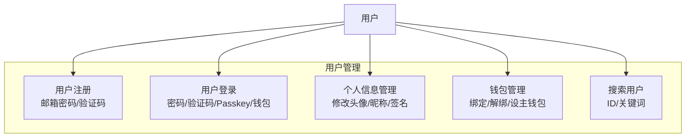

#### 2.2.2 好友系统用例

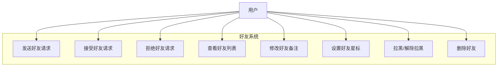

#### 2.2.3 消息用例

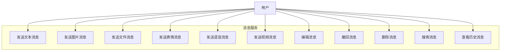

---

## 3 系统时序图

### 3.1 用户注册时序图

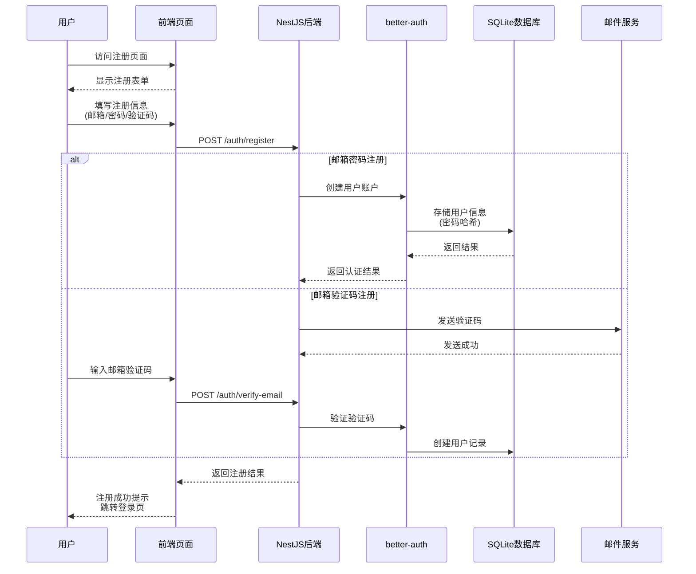

### 3.2 用户登录时序图

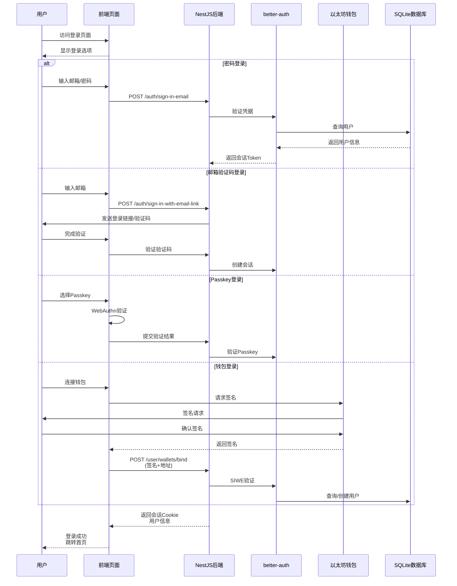

### 3.3 添加好友时序图

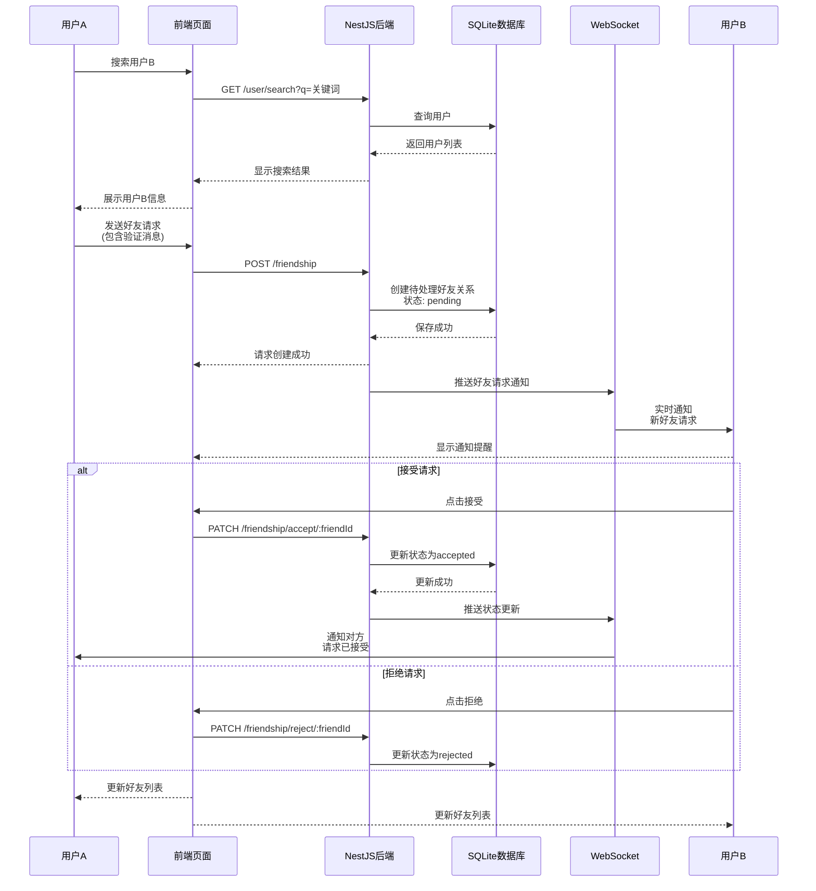

### 3.4 发送消息时序图

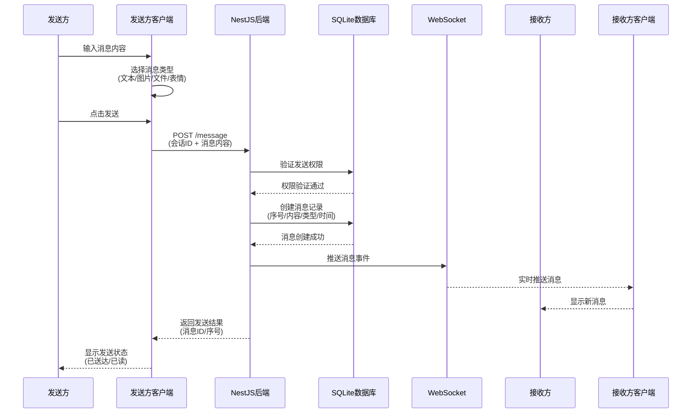

### 3.5 消息撤回时序图

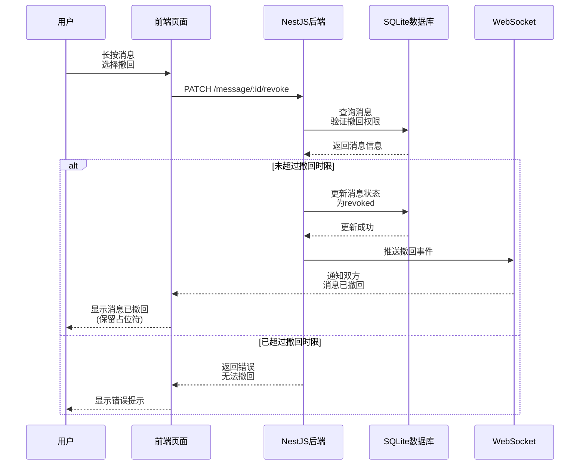

### 3.6 发起语音通话时序图

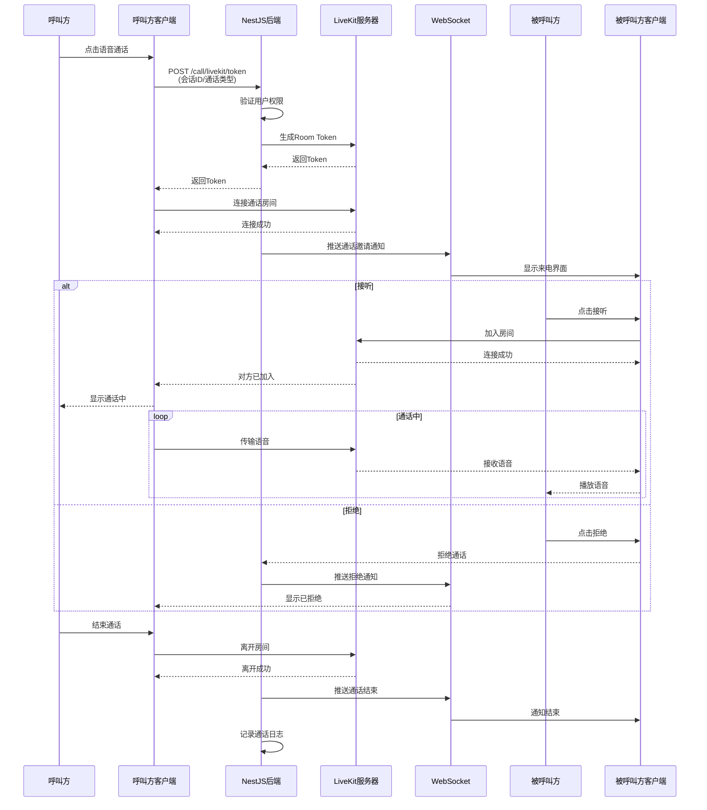

### 3.7 AI对话时序图

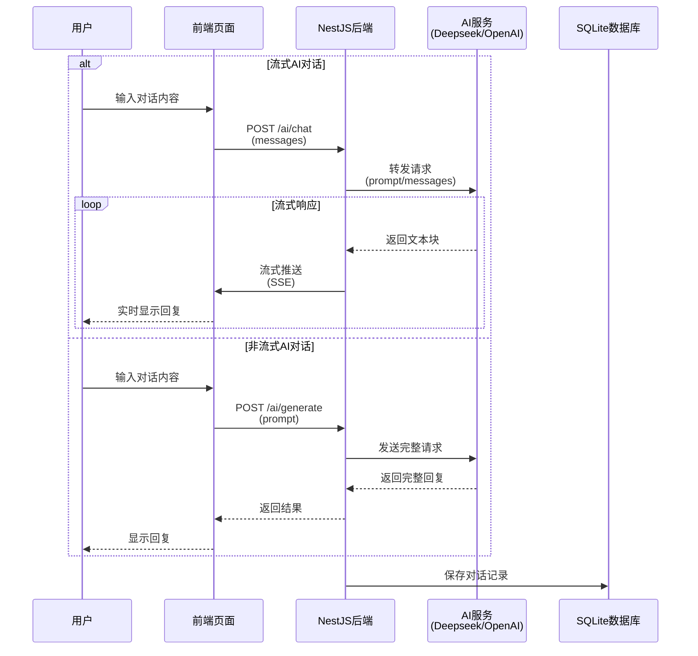

### 3.8 创建群聊时序图

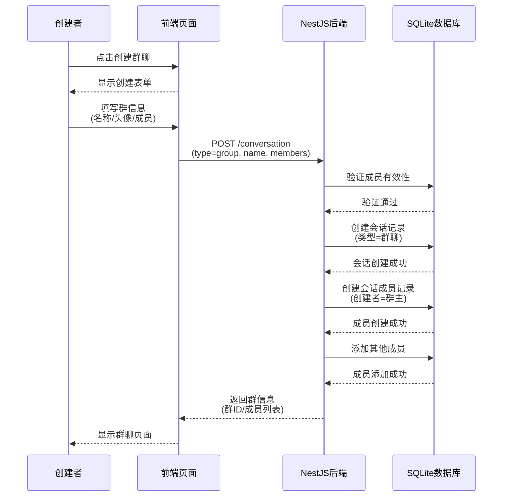

---

## 4 数据库ER图

### 4.1 核心实体关系图

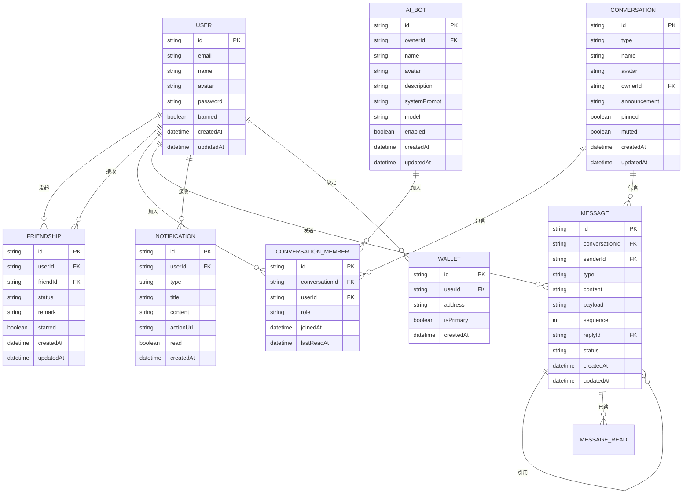

### 4.2 数据库表关系详细图

```mermaid
graph TB
    subgraph 用户表[User]
        U1["id: String(PK)"]
        U2["email: String"]
        U3["name: String"]
        U4["avatar: String"]
        U5["password: String"]
        U6["banned: Boolean"]
        U7["createdAt: DateTime"]
    end
    
    subgraph 好友关系表[Friendship]
        F1["id: String(PK)"]
        F2["userId: String(FK)"]
        F3["friendId: String(FK)"]
        F4["status: Enum(pending/accepted/rejected/blocked)"]
        F5["remark: String"]
        F6["starred: Boolean"]
    end
    
    subgraph 会话表[Conversation]
        C1["id: String(PK)"]
        C2["type: Enum(private/group)"]
        C3["name: String"]
        C4["avatar: String"]
        C5["ownerId: String(FK)"]
        C6["announcement: String"]
        C7["pinned: Boolean"]
        C8["muted: Boolean"]
    end
    
    subgraph 会话成员表[ConversationMember]
        CM1["id: String(PK)"]
        CM2["conversationId: String(FK)"]
        CM3["userId: String(FK)"]
        CM4["role: Enum(owner/admin/member)"]
        CM5["joinedAt: DateTime"]
        CM6["lastReadAt: DateTime"]
    end
    
    subgraph 消息表[Message]
        M1["id: String(PK)"]
        M2["conversationId: String(FK)"]
        M3["senderId: String(FK)"]
        M4["type: Enum(text/image/file/emoji/voice/video/system)"]
        M5["content: String"]
        M6["payload: JSON"]
        M7["sequence: Int"]
        M8["replyId: String(FK)"]
        M9["status: Enum(normal/edited/revoked/deleted)"]
    end
    
    subgraph 通知表[Notification]
        N1["id: String(PK)"]
        N2["userId: String(FK)"]
        N3["type: Enum(friend_request/message/system)"]
        N4["title: String"]
        N5["content: String"]
        N6["actionUrl: String"]
        N7["read: Boolean"]
    end
    
    subgraph 钱包表[Wallet]
        W1["id: String(PK)"]
        W2["userId: String(FK)"]
        W3["address: String"]
        W4["isPrimary: Boolean"]
    end
    
    subgraph AI机器人表[AiBot]
        B1["id: String(PK)"]
        B2["ownerId: String(FK)"]
        B3["name: String"]
        B4["avatar: String"]
        B5["description: String"]
        B6["systemPrompt: String"]
        B7["model: String"]
        B8["enabled: Boolean"]
    end
    
    U1 --> F2
    U1 --> F3
    C2 --> CM2
    C2 --> M2
    U1 --> CM3
    U1 --> M3
    U1 --> N2
    U1 --> W2
    U1 --> B2
    M1 --> M8
```

---

## 5 类图

### 5.1 前端核心类图

```mermaid
classDiagram
    class User {
        +string id
        +string email
        +string name
        +string avatar
        +boolean banned
        +DateTime createdAt
        +updateProfile(data: UserProfile): Promise~void~
        +changePassword(oldPwd: string, newPwd: string): Promise~void~
    }
    
    class Conversation {
        +string id
        +string type
        +string name
        +string avatar
        +string? announcement
        +boolean pinned
        +boolean muted
        +Message? lastMessage
        +number unreadCount
        +createMessage(content: MessageContent): Promise~Message~
        +getMessages(page: number): Promise~Message[]~
        +addMember(userId: string): Promise~void~
        +removeMember(userId: string): Promise~void~
    }
    
    class Message {
        +string id
        +string conversationId
        +string senderId
        +MessageType type
        +string content
        +Json payload
        +number sequence
        +string? replyId
        +MessageStatus status
        +DateTime createdAt
        +edit(newContent: string): Promise~void~
        +revoke(): Promise~void~
        +delete(): Promise~void~
    }
    
    class Friend {
        +string id
        +User user
        +string remark
        +boolean starred
        +FriendStatus status
        +updateRemark(remark: string): Promise~void~
        +setStarred(starred: boolean): Promise~void~
        +block(): Promise~void~
        +unblock(): Promise~void~
        +remove(): Promise~void~
    }
    
    class Notification {
        +string id
        +NotificationType type
        +string title
        +string content
        +string? actionUrl
        +boolean read
        +DateTime createdAt
        +markAsRead(): Promise~void~
        +delete(): Promise~void~
    }
    
    class AiBot {
        +string id
        +string name
        +string avatar
        +string description
        +string systemPrompt
        +string model
        +boolean enabled
        +chat(prompt: string): Promise~string~
        +streamChat(prompt: string): AsyncGenerator~string~
        +update(data: BotData): Promise~void~
        +delete(): Promise~void~
    }
    
    User "1" --> "*" Conversation : 参与
    User "1" --> "*" Friend : 拥有
    Conversation "1" --> "*" Message : 包含
    Message "1" --> "0..1" Message : 引用
    User "1" --> "*" Notification : 接收
    User "1" --> "*" AiBot : 创建
    
    <<interface>> MessageContent
    MessageContent : +string type
    MessageContent : +string content
    MessageContent : +Json? payload
    
    <<enum>> MessageType
    MessageType : text
    MessageType : image
    MessageType : file
    MessageType : emoji
    MessageType : voice
    MessageType : video
    MessageType : system
    
    <<enum>> MessageStatus
    MessageStatus : normal
    MessageStatus : edited
    MessageStatus : revoked
    MessageStatus : deleted
```

### 5.2 后端服务类图

```mermaid
classDiagram
    class UserService {
        +PrismaClient prisma
        +findById(id: string): Promise~User~
        +findByEmail(email: string): Promise~User~
        +search(query: string): Promise~User[]~
        +update(id: string, data: UpdateUserDto): Promise~User~
        +ban(id: string, reason: string): Promise~void~
        +unban(id: string): Promise~void~
    }
    
    class FriendService {
        +PrismaClient prisma
        +createRequest(userId: string, friendId: string, message?: string): Promise~Friendship~
        +acceptRequest(friendId: string): Promise~Friendship~
        +rejectRequest(friendId: string): Promise~Friendship~
        +block(userId: string, friendId: string): Promise~Friendship~
        +unblock(userId: string, friendId: string): Promise~Friendship~
        +getFriends(userId: string): Promise~Friendship[]~
        +getBlockedList(userId: string): Promise~Friendship[]~
    }
    
    class ConversationService {
        +PrismaClient prisma
        +createPrivate(userIds: string[]): Promise~Conversation~
        +createGroup(name: string, ownerId: string, memberIds: string[]): Promise~Conversation~
        +addMember(conversationId: string, userId: string): Promise~ConversationMember~
        +removeMember(conversationId: string, userId: string): Promise~void~
        +updateSettings(conversationId: string, settings: ConversationSettings): Promise~Conversation~
        +transferOwner(conversationId: string, newOwnerId: string): Promise~void~
    }
    
    class MessageService {
        +PrismaClient prisma
        +WebSocketGateway wsGateway
        +send(conversationId: string, senderId: string, content: MessageDto): Promise~Message~
        +edit(messageId: string, userId: string, content: string): Promise~Message~
        +revoke(messageId: string, userId: string): Promise~void~
        +delete(messageId: string, userId: string): Promise~void~
        +getHistory(conversationId: string, cursor?: string, limit?: number): Promise~Message[]~
        +search(conversationId: string, keyword: string): Promise~Message[]~
    }
    
    class NotificationService {
        +PrismaClient prisma
        +WebSocketGateway wsGateway
        +create(userId: string, type: NotificationType, data: NotificationData): Promise~Notification~
        +markAsRead(notificationId: string, userId: string): Promise~void~
        +markAllAsRead(userId: string): Promise~void~
        +getList(userId: string, page: number): Promise~Notification[]~
    }
    
    class AiService {
        +LanguageModel[] models
        +chat(messages: Message[], model: string): Promise~string~
        +streamChat(messages: Message[], model: string): AsyncGenerator~string~
    }
    
    class CallService {
        +PrismaClient prisma
        +LiveKitService liveKit
        +generateToken(roomName: string, identity: string): Promise~string~
        +startCall(conversationId: string, callerId: string, type: CallType): Promise~Call~
        +endCall(callId: string): Promise~void~
    }
    
    UserService --> PrismaClient
    FriendService --> PrismaClient
    ConversationService --> PrismaClient
    MessageService --> PrismaClient
    MessageService --> WebSocketGateway
    NotificationService --> PrismaClient
    NotificationService --> WebSocketGateway
    CallService --> PrismaClient
    CallService --> LiveKitService
    
    <<interface>> PrismaClient
    <<interface>> WebSocketGateway
    <<interface>> LiveKitService
```

---

## 6 状态图

### 6.1 好友关系状态图

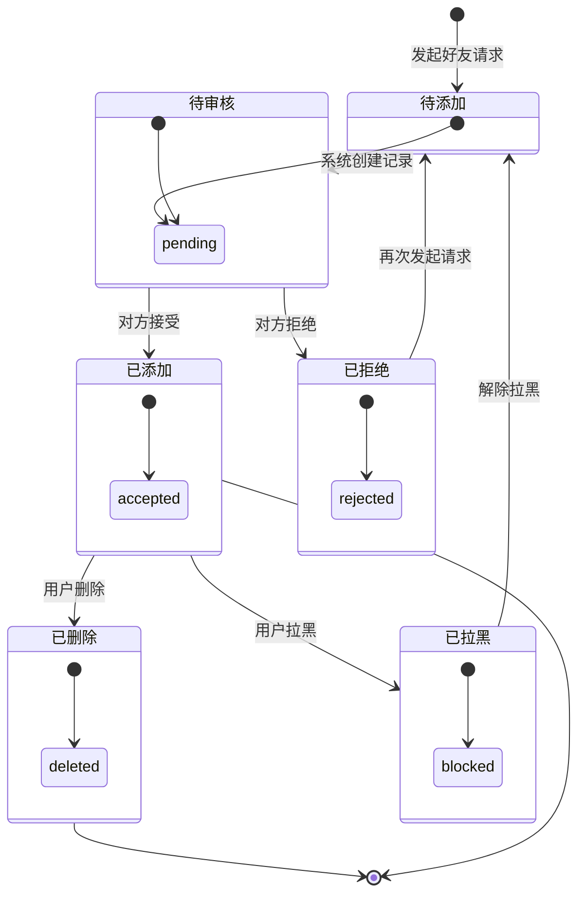

### 6.2 消息状态图

```mermaid
stateDiagram-v2
    [*] --> 发送中: 用户点击发送
    发送中 --> 已送达: 服务器确认
    已送达 --> 已读: 接收方查看
    已送达 --> 已撤回: 发送方撤回
    已读 --> [*]
    已撤回 --> [*]
    
    发送中 --> 发送失败: 网络错误
    发送失败 --> [*]
    
    已送达 --> 已编辑: 发送方编辑
    已编辑 --> 已送达
    
    note right of 已撤回
      双方可见撤回占位符
    end note
    
    note right of 已读
      显示已读时间戳
    end note
```

### 6.3 会话状态图

```mermaid
stateDiagram-v2
    [*] --> 正常: 创建会话
    正常 --> 置顶: 用户设置置顶
    置顶 --> 正常: 用户取消置顶
    正常 --> 免打扰: 用户开启免打扰
    免打扰 --> 正常: 用户关闭免打扰
    正常 --> 已删除: 用户删除会话
    已删除 --> [*]
    
    state 正常 {
        [*] --> active
    }
    
    state 置顶 {
        [* --> pinned]
    }
    
    state 免打扰 {
        [*] --> muted
    }
    
    state 已删除 {
        [*] --> deleted
    }
```

### 6.4 通话状态图

```mermaid
stateDiagram-v2
    [*] --> 振铃中: 用户发起通话
    振铃中 --> 通话中: 被叫方接听
    振铃中 --> 已取消: 呼叫方取消
    振铃中 --> 已拒绝: 被叫方拒绝
    通话中 --> 已结束: 任一方挂断
    
    state 振铃中 {
        [*] --> ringing
    }
    
    state 通话中 {
        [*] --> connected
        
        state 语音通话 {
            [*] --> audio_only
        }
        
        state 视频通话 {
            [*] --> video_enabled
        }
    }
    
    state 已取消 {
        [*] --> cancelled
    }
    
    state 已拒绝 {
        [*] --> rejected
    }
    
    state 已结束 {
        [*] --> ended
    }
```

---

## 7 活动图

### 7.1 用户注册活动图

```mermaid
flowchart TD
    A([开始]) --> B{选择注册方式}
    B -->|邮箱密码| C[填写邮箱密码]
    B -->|邮箱验证码| D[填写邮箱]
    B -->|Passkey| E[选择认证方式]
    
    C --> F[前端验证输入]
    D --> G[发送验证码]
    G --> H[填写验证码]
    E --> I[WebAuthn注册]
    
    F --> I
    H --> I
    
    I --> J{验证结果}
    J -->|成功| K[创建用户账户]
    J -->|失败| L[显示错误信息]
    L --> B
    
    K --> M[生成会话Token]
    M --> N[返回注册结果]
    N --> O([结束])
```

### 7.2 发送消息活动图

```mermaid
flowchart TD
    A([开始]) --> B[用户输入消息内容]
    B --> C{选择消息类型}
    
    C -->|文本| D[直接输入文本]
    C -->|图片| E[选择本地图片]
    C -->|文件| F[选择本地文件]
    C -->|表情| G[选择表情]
    C -->|引用| H[选择引用消息]
    
    D --> I
    E --> I[上传文件到服务器]
    F --> I
    G --> I
    H --> I
    
    I --> J[点击发送按钮]
    J --> K{检查网络状态}
    
    K -->|在线| L[发送HTTP请求]
    K -->|离线| M[提示网络异常]
    M --> B
    
    L --> N{服务器响应}
    
    N -->|成功| O[创建消息记录]
    O --> P[WebSocket推送]
    P --> Q[更新发送状态]
    Q --> R([结束])
    
    N -->|失败| S[显示发送失败]
    S --> B
```

### 7.3 创建群聊活动图

```mermaid
flowchart TD
    A([开始]) --> B[点击创建群聊按钮]
    B --> C[填写群名称]
    C --> D[上传群头像<br/>可选]
    D --> E[添加群成员]
    
    E --> F{检查成员有效性}
    F -->|有效| G[确认成员列表]
    F -->|无效| H[提示无效成员]
    H --> E
    
    G --> I[点击创建按钮]
    I --> J[发送创建请求]
    
    J --> K{服务器处理}
    
    K -->|成功| L[创建会话记录]
    L --> M[创建群主成员]
    M --> N[创建其他成员]
    N --> O[返回群信息]
    O --> P[跳转到群页面]
    P --> Q([结束])
    
    K -->|失败| R[显示错误信息]
    R --> C
```

---

## 8 组件图

### 8.1 前端组件架构图

```mermaid
graph TB
    subgraph 页面层[Pages]
        Auth["/pages/auth/*<br/>认证页面"]
        Chat["/pages/chat/*<br/>聊天页面"]
        Profile["/pages/profile/*<br/>个人中心"]
        Admin["/pages/admin/*<br/>管理后台"]
        Settings["/pages/settings/*<br/>设置页面"]
    end
    
    subgraph 布局层[Layouts]
        Main["main.vue<br/>主布局"]
        Auth["auth.vue<br/>认证布局"]
        Admin["admin.vue<br/>管理布局"]
    end
    
    subgraph 业务组件层[Components/app]
        ChatList["chat/ChatList<br/>会话列表"]
        ChatItem["chat/ChatItem<br/>会话项"]
        ChatContent["chat/ChatContent<br/>聊天内容"]
        MessageItem["message/MessageItem<br/>消息项"]
        MessageList["message/MessageList<br/>消息列表"]
        DialogCreateGroup["dialog/CreateGroup<br/>创建群聊"]
        DialogGroupInfo["dialog/GroupInfo<br/>群信息"]
        FriendList["contact/FriendList<br/>好友列表"]
    end
    
    subgraph 基础组件层[Components/base]
        Avatar["base/avatar<br/>头像"]
        Modal["base/modal<br/>模态框"]
        Toast["base/toast<br/>提示"]
        Dialog["base/dialog<br/>对话框"]
        Editor["base/editor<br/>编辑器"]
        ContextMenu["base/context-menu<br/>右键菜单"]
    end
    
    subgraph 状态管理层[Stores]
        UserStore["useUserStore<br/>用户状态"]
        SettingsStore["useSettingsStore<br/>设置状态"]
        CallStore["useCallStore<br/>通话状态"]
        DialogStore["useDialogStore<br/>对话框状态"]
    end
    
    subgraph API层[API]
        UserAPI["api/user.ts<br/>用户接口"]
        FriendAPI["api/friendship.ts<br/>好友接口"]
        ConvAPI["api/conversation.ts<br/>会话接口"]
        MsgAPI["api/message.ts<br/>消息接口"]
        NotifAPI["api/notification.ts<br/>通知接口"]
        AIClient["api/ai.ts<br/>AI接口"]
        CallAPI["api/call.ts<br/>通话接口"]
    end
    
    subgraph 核心层[Core]
        Socket["core/socket<br/>WebSocket"]
        RTC["core/rtc<br/>实时通信"]
        Menu["core/menu<br/>菜单服务"]
        Theme["core/theme<br/>主题服务"]
        AuthClient["core/auth<br/>认证客户端"]
    end
    
    Pages --> Layouts
    Layouts --> 业务组件层
    业务组件层 --> 基础组件层
    业务组件层 --> 状态管理层
    状态管理层 --> API层
    API层 --> 核心层
```

### 8.2 后端组件架构图

```mermaid
graph TB
    subgraph 网关层[Gateway]
        HTTP["HTTP Gateway<br/>Express/Fastify"]
        WS["WebSocket Gateway<br/>Socket.io"]
        SSE["SSE Gateway<br/>Server-Sent Events"]
    end
    
    subgraph 认证模块[Auth]
        Session["Session管理"]
        EmailAuth["邮箱认证"]
        Passkey["Passkey认证"]
        SIWE["SIWE钱包认证"]
    end
    
    subgraph 业务模块[Modules]
        UserModule["用户模块"]
        FriendModule["好友模块"]
        ConvModule["会话模块"]
        MsgModule["消息模块"]
        NotifModule["通知模块"]
        AIModule["AI模块"]
        CallModule["通话模块"]
        AdminModule["管理模块"]
    end
    
    subgraph 公共服务[Common]
        Guard["权限守卫"]
        Filter["异常过滤器"]
        Interceptor["拦截器"]
        Pipe["验证管道"]
    end
    
    subgraph 数据访问层[DAL]
        PrismaClient["Prisma Client"]
        Redis["Redis 缓存"]
    end
    
    subgraph 外部服务[External]
        LiveKit["LiveKit"]
        Email["邮件服务"]
        AI["AI 服务"]
    end
    
    HTTP --> 认证模块
    HTTP --> 业务模块
    WS --> 认证模块
    WS --> 业务模块
    SSE --> AIModule
    
    业务模块 --> 公共服务
    公共服务 --> PrismaClient
    业务模块 --> Redis
    业务模块 --> LiveKit
    AIModule --> AI
    认证模块 --> Email
```

---

## 9 数据流图

### 9.1 消息收发数据流图

```mermaid
flowchart LR
    subgraph 客户端
        UI["用户界面<br/>Vue组件"]
        Store["状态管理<br/>Pinia"]
        Socket["WebSocket<br/>客户端"]
        API["API请求<br/>封装"]
    end
    
    subgraph 服务端
        LB["负载均衡<br/>Nginx"]
        Gateway["API Gateway<br/>NestJS"]
        Auth["认证服务<br/>better-auth"]
        Business["业务服务<br/>各Module"]
        Cache["Redis缓存"]
        DB["SQLite数据库"]
        WS["WebSocket<br/>Gateway"]
    end
    
    subgraph 第三方
        AI["AI服务"]
        LiveKit["LiveKit"]
    end
    
    UI -->|输入消息| Store
    Store -->|发送请求| API
    API -->|HTTP| LB
    LB -->|转发| Gateway
    Gateway -->|验证| Auth
    Auth -->|通过| Business
    
    Business -->|读写| Cache
    Business -->|持久化| DB
    
    Business -->|推送| WS
    WS -->|WebSocket| Socket
    Socket -->|更新| Store
    Store -->|渲染| UI
```

### 9.2 实时通话数据流图

```mermaid
flowchart LR
    subgraph 客户端A
        UA["用户A"]
        ClientA["Tauri/Nuxt应用"]
        RTC_A["WebRTC<br/>客户端"]
    end
    
    subgraph 信令服务器
        Backend["NestJS后端"]
        Token["Token签发"]
    end
    
    subgraph 媒体服务器
        LK["LiveKit服务器"]
        Audio["音频流"]
        Video["视频流"]
    end
    
    subgraph 客户端B
        RTC_B["WebRTC<br/>客户端"]
        ClientB["Tauri/Nuxt应用"]
        UB["用户B"]
    end
    
    UA -->|发起通话| ClientA
    ClientA -->|请求Token| Backend
    Backend -->|验证权限| Token
    Token -->|返回Token| ClientA
    
    ClientA -->|连接Room| LK
    LK -->|创建房间| LK
    
    Backend -->|通知| ClientB
    ClientB -->|加入Room| LK
    
    LK -->|建立P2P| RTC_B
    RTC_B -->|传输| UB
    
    LK -->|建立P2P| RTC_A
    RTC_A -->|传输| UA
    
    Audio -.->|UDP/TCP| LK
    Video -.->|UDP/TCP| LK
```

---

## 10 图表在论文中的位置建议

根据论文结构，建议将各图表放置在以下章节：

| 图表名称 | 建议放置位置 | 说明 |
|---------|-------------|------|
| 系统架构图 | 第四章 4.1.1 整体架构 | 展示系统的技术架构和模块组成 |
| 系统部署架构图 | 第四章 4.1.3 部署架构 | 展示系统在生产环境的部署方式 |
| 总体用例图 | 第三章 3.4 用例分析 | 展示系统所有用例和角色关系 |
| 核心用例详细图 | 第三章 3.4 用例分析 | 详细展示各功能模块的用例 |
| 数据库ER图 | 第四章 4.3 数据库设计 | 展示数据实体及其关系 |
| 类图 | 第四章 4.2 模块划分 | 展示前后端核心类结构 |
| 状态图 | 第四章 4.2 模块划分 | 展示状态流转过程 |
| 活动图 | 第三章 3.4 或 第五章 | 展示业务流程 |
| 组件图 | 第四章 4.1 技术架构 | 展示组件架构 |
| 数据流图 | 第四章 4.1.2 技术架构 | 展示数据流向 |
| 用户注册时序图 | 第三章 3.4 用例分析 | 展示注册业务流程 |
| 添加好友时序图 | 第三章 3.4 用例分析 | 展示好友添加业务流程 |
| 发送消息时序图 | 第三章 3.4 或 第五章 5.4 | 展示消息收发核心流程 |
| 消息撤回时序图 | 第五章 5.4 消息服务模块 | 展示消息撤回具体实现 |
| 发起语音通话时序图 | 第三章 3.4 或 第五章 5.7 | 展示通话建立流程 |
| AI对话时序图 | 第五章 5.6 AI机器人模块 | 展示AI功能实现流程 |
| 创建群聊时序图 | 第五章 5.3 会话管理模块 | 展示群聊创建流程 |
